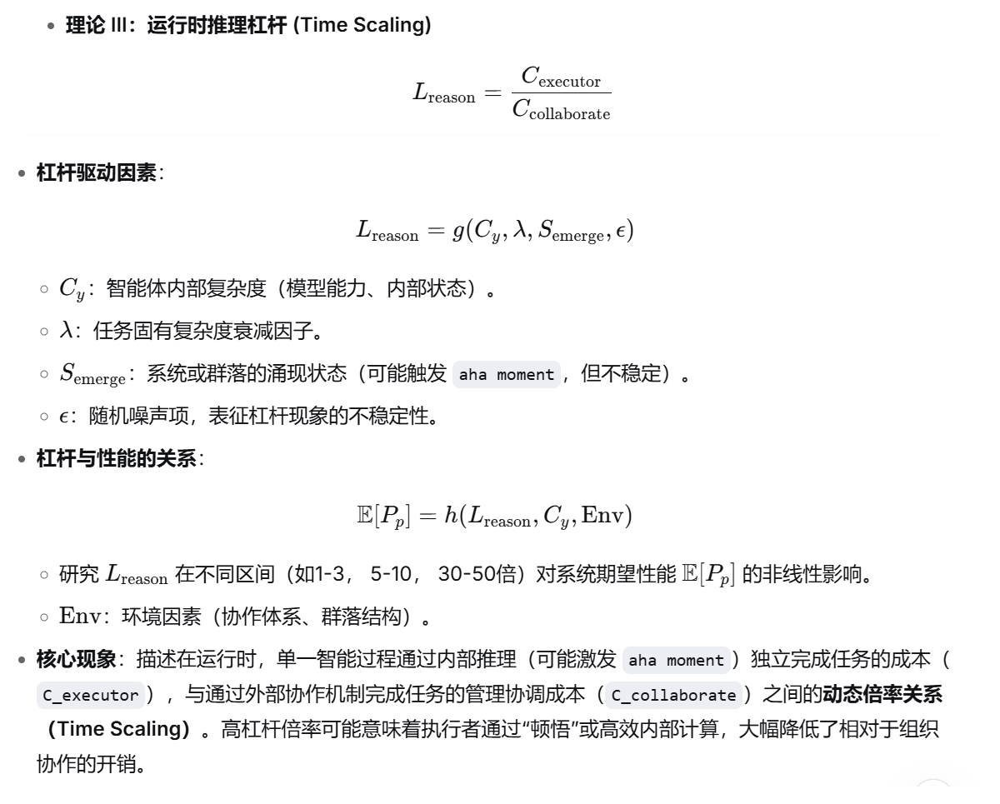

####     一切承载可用于引导模型产出的信息载体，即为智能体；定向智能发生于引导，模型是智能可能性的叠加态空间，引导动作使其坍缩析出定向智能。
####     ∣Ψ⟩=i∑ci∣ψi⟩, i∑∣ci∣2=1
####     反之，从连续智能过程（模型）视角，则是在外部信息环境中通过有限步骤的随机游走达到期望产出。起外部引导作用的信息空间本身必须是一个适合随机游走的流形空间——信息的组织方式决定了引导的有效性。（业界智能应用的本质，尤其企业领域的内部应用，本质即在构建这样的信息空间。只不过个人的信息空间是独享的，而企业的信息空间，可能是岗位多层次共享的。）
####     模型空间是智能可能性的叠加态；外部信息空间是知识结构的确定流形，但在连续智能过程视角呈现为“待探索的可能性”。连续智能过程需要在两个空间上执行受控随机游走：模型空间从叠加态坍缩至特定输出，外部空间从模糊的候选区域收敛至目标结构。两个空间的坍缩并非独立，而是在游走中互为镜像、协同发生，共同析出定向智能。
####     未来智能应用架构是关于信息及信息结构载体的架构。

### 定义1：每消耗 1 单位的管理成本，能撬动多少单位的有效执行成本。

